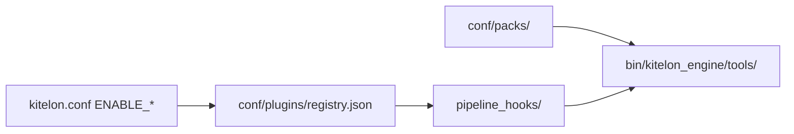

# Kitelon modularity

How plugins, addons, and packs are represented in code. Vocabulary: [GLOSSARY.md](GLOSSARY.md).

## Architecture



1. **Config** — `ENABLE_*` flags (and API keys) gate plugins via `ScanContext.options`.
2. **Registry** — [`conf/plugins/registry.json`](../conf/plugins/registry.json) lists every plugin: id, wrapper, config flag, pipelines, addons, packs.
3. **Pack loader** — [`bin/kitelon_engine/pack_loader.py`](../bin/kitelon_engine/pack_loader.py) loads JSON packs from `conf/packs/<plugin>/`.
4. **Pipeline hooks** — [`bin/kitelon_engine/pipeline_hooks/`](../bin/kitelon_engine/pipeline_hooks/) run registry-enabled plugins per pipeline slice.
5. **Wrappers** — [`bin/kitelon_engine/tools/`](../bin/kitelon_engine/tools/) invoke upstream binaries and write loot.

## PluginSpec

| Field | Purpose |
|-------|---------|
| `id` | Stable plugin id (registry key) |
| `label` | Operator-facing name |
| `wrapper` | Python module under `kitelon_engine/tools/` |
| `config_option` | Key in `ScanContext.options` (e.g. `enable_subfinder`) |
| `always_on` | Run whenever the pipeline runs (e.g. nmap core pass) |
| `pipelines` | Tags: `recon`, `osint`, `web`, `port`, `service`, `normal`, … |
| `order` | Sort key within a pipeline |
| `addons` | Named addons documented for this plugin |
| `packs` | Pack ids under `conf/packs/<plugin>/` |

API: [`bin/kitelon_engine/plugin_registry.py`](../bin/kitelon_engine/plugin_registry.py)

```python
from kitelon_engine.plugin_registry import get_registry

registry = get_registry(str(ctx.install_dir))
for spec in registry.for_pipeline("recon", ctx):
    ...
```

## Pack format

Packs are JSON objects in `conf/packs/<plugin_id>/<pack_id>.json`.

First shipped pack: **Metasploit default scanners** — [`conf/packs/metasploit/scanners.json`](../conf/packs/metasploit/scanners.json). Consumed by [`metasploit.py`](../bin/kitelon_engine/tools/metasploit.py) via `load_pack(install_dir, "metasploit", "scanners")`.

Future packs (Phase B+): nuclei templates path, wordlists — same loader, install layout TBD.

## Migration status

| Pipeline slice | Status |
|----------------|--------|
| **recon** (subfinder, dnsx, dnsrecon, gau) | Registry + [`pipeline_hooks/recon.py`](../bin/kitelon_engine/pipeline_hooks/recon.py) |
| **osint** | Registry documented; hooks still inline in `osint.py` |
| **web** / **port** / **service** | Registry documented; hooks still inline in `steps.py` |

Incremental migration: move one pipeline slice at a time to hooks; do not big-bang `steps.py`.

## Adding a plugin (contributor checklist)

1. Wrapper in `bin/kitelon_engine/tools/<name>.py`
2. `ENABLE_*` in `examples/kitelon.conf` + `config.py` mapping
3. Entry in `conf/plugins/registry.json`
4. Pipeline hook (registry-driven) or documented inline step
5. Row in [PLUGINS.md](PLUGINS.md) and [TOOLS.md](TOOLS.md)

## Adding a pack (content only)

1. JSON under `conf/packs/<plugin_id>/<pack_id>.json`
2. Reference `packs: ["<pack_id>"]` on the plugin in registry
3. Load via `pack_loader.load_pack()` in the plugin wrapper
4. Document in PLUGINS.md

## Non-goals (v1)

- Third-party plugins loaded from arbitrary Python on disk
- Hot-reload without worker restart
- Replacing `install.sh` in this phase (install grouping comes in Phase B)
